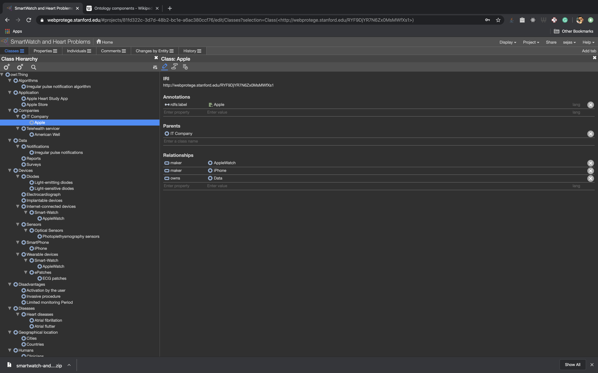
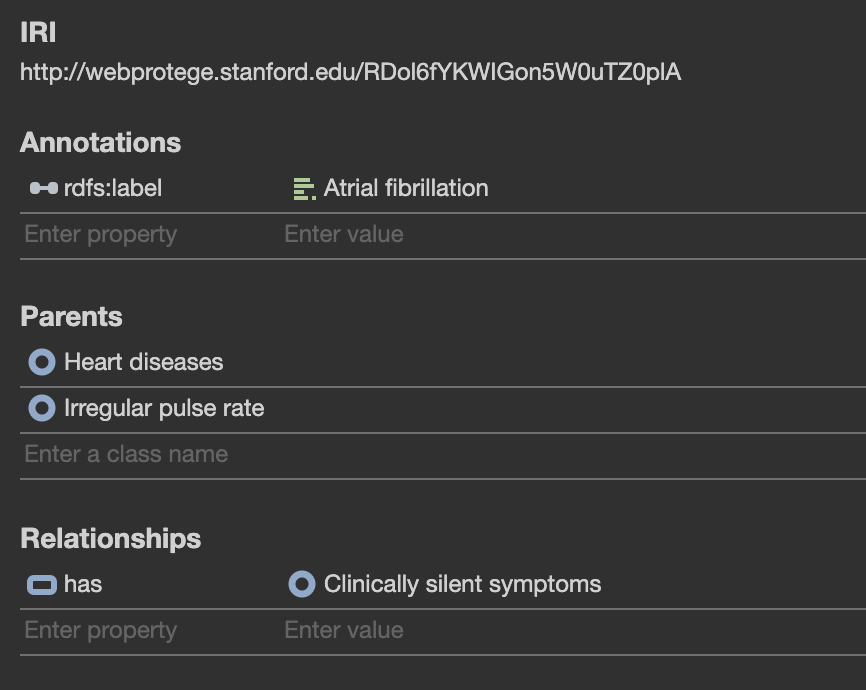
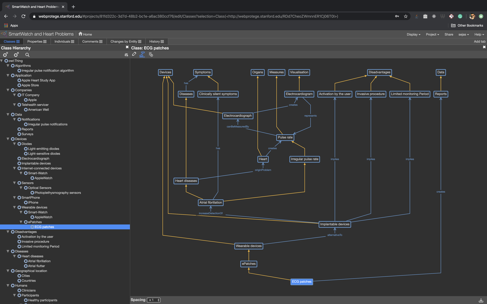
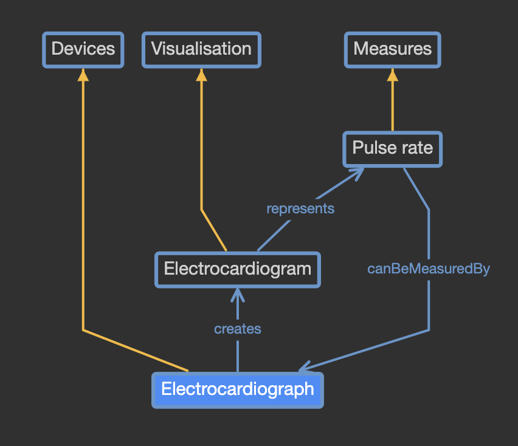
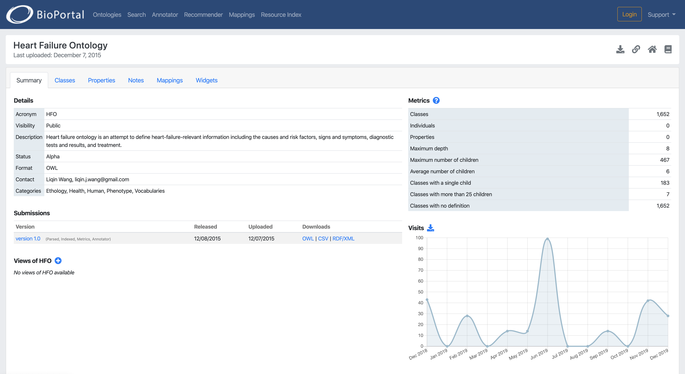
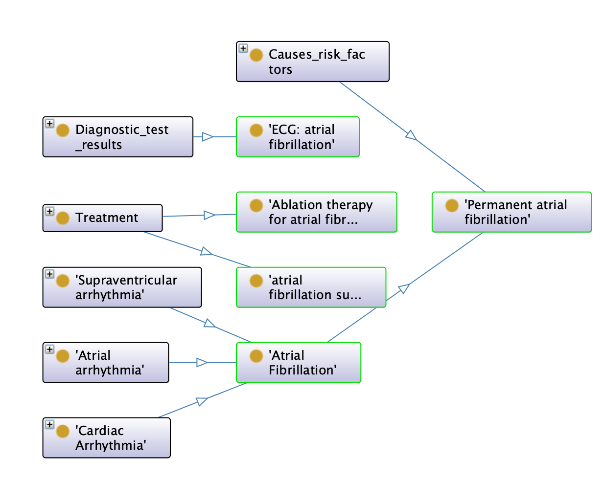

# ONTOLOGY TO MODEL ATRIAL FIBRILLATION DETECTION WITH APPLE WATCH

- UNIVERSIDAD POLITÉCNICA DE MADRID
- MSC IN ARTIFICIAL INTELLIGENCE
- BIOMEDICAL INFORMATICS
- January 9th, 2020

## Authors

- [Antonio Sejas](https://sejas.es)
- Lynn Ghandour 

## Abstract

This document describes the ontology created to model a medical article creating an ontology. It was an assignment for the biomedical informatics subject.

During the development of this ontology, we have acquired new skills and improved others, such as searching for medical scientific papers in the relevant publications, extracting key concepts belonging to the domain field of our article and creating an ontology that models these concepts using [Protégé](https://protege.stanford.edu/).

## Results

- The ontology ([Download](smartwatch-and-heart-problems-ontologies.owl)).
- The report (not uploaded here).

## Ontology Screenshots

### Creation

### Model

### Extending

## Article

Marco V Perez et al. “Large-scale assessment of a smartwatch to identify atrialfibrillation”.  In:New  England  Journal  of  Medicine381.20  (2019),  pp.  1909–1917.